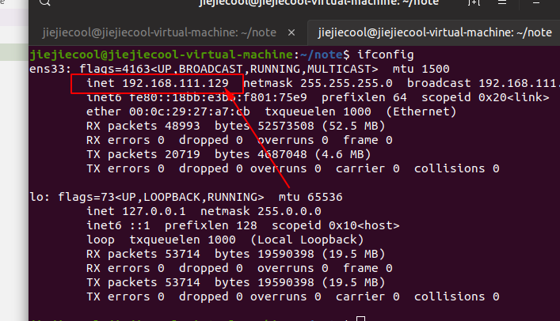

宿主机： win10
虚拟机： ubuntu19

1. 首先 虚拟机使用NAT模式，已经可以访问外部网络  

2. ip addr 或者安装net-tools之后查看ifconfig，得到ip地址
   





3. 宿主机中看是否能ping通
   
```shell  
    ping ip
```
   4. 查看虚拟机是否安装了相应的组件

```
    sudo apt-get install openssh-server
```
5. 开启防火墙端口  
 ```
firewall-cmd --zone=public --add-port=22/tcp --permanent
```