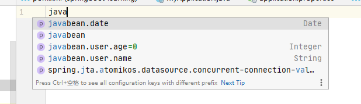

如何开启热部署？

在pom中依赖

```java
  <dependency>
            <groupId>org.springframework.boot</groupId>
            <artifactId>spring-boot-devtools</artifactId>
        </dependency>
```

idea中每次更改完代码重新编译即可


------------------------------

springboot启动时可以使用指定的配置文件  

使用场景：测试时使用个人配置文件或者多环境时使用其他环境的配置文件  

`java -jar myproject.jar --spring.config.name=myproject`    

或者使用classpath指定多个配置文件
```java
java -jar myproject.jar --spring.config.location=\
    optional:classpath:/default.properties,\
    optional:classpath:/override.properties
```
-----------------------------

属性配置时，可以根据yml来定义javabean，也有根据javabean写yml的情况
根据javabean写yml可能会比较复杂，因为java对象中可以嵌套各种不同的属性，
这时候我们可以增加一个jar包来提升我们的开发效率，包括自动提示等

```java
  <dependency>
            <groupId>org.springframework.boot</groupId>
            <artifactId>spring-boot-configuration-processor</artifactId>
            <optional>true</optional>
        </dependency>
```

maven依赖引入之后，重新编译项目，然后在yml里面写属性名称就会有自动提示,例如



